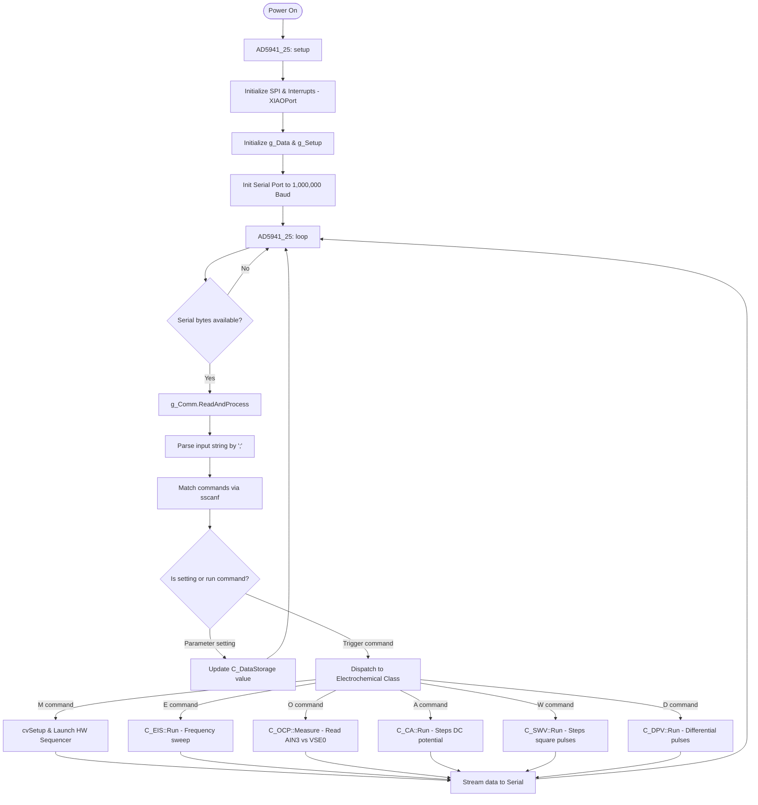

# Architecture Document: HunStat2 (AD5941_25 Firmware)

This document provides a comprehensive overview of the design, module structure, control flow, command-parsing protocol, and hardware details of the HunStat2 firmware (`AD5941_25`).

---

## 1. System Overview

**HunStat2** is a modular firmware written in C/C++ (Arduino framework) designed to run on a microcontroller (e.g., Seeed Studio XIAO RP2040) interfaced with the **Analog Devices AD5940/AD5941** electrochemical analog front-end (AFE) chip. 

The firmware allows performing several electrochemical techniques and streaming the measurement results back to a host computer (like a Python UI or LabVIEW test interface) over a high-speed Serial port (default baudrate: 1,000,000).

```
   +------------------+                    +-----------------------+
   |                  |    Serial Comm     |  Microcontroller      |
   |     Host PC      |<==================>|  (Seeed XIAO RP2040)  |
   | (Python UI / LVs)|  (e.g. 1M Baud)    |                       |
   +------------------+                    +-----------+-----------+
                                                       |
                                                       | SPI / Pins
                                                       v
                                           +-----------------------+
                                           |      AD5940/AD5941    |
                                           |      Potentiostat     |
                                           +-----------------------+
```

---

## 2. Directory and File Structure

> **Note on physical location (2026-08-01):** the tree below now lives at `Software/update 2 (18 Juli 26)/AD5941_25/`, a separate reorganized copy of the project alongside the original `Software/AD5941_25/` path this document was originally written against. A second, older monolithic sketch, `HunStat2.ino` — sharing ~20 top-level function names (including `setup()`/`loop()`) with `AD5941_25.ino` — was briefly relocated into this same folder during that reorganization, which breaks compilation outright (Arduino compiles every `.ino` in a sketch folder as one program). It has since been moved to its own sibling sketch folder, `Software/update 2 (18 Juli 26)/HunStat2/`. See `UPDATE_2026-08-01.md` §1 for the full fix, including a stale relative-include bug (`../src/...`) that also had to be corrected before the folder-conflict issue was even visible.

The project has been refactored from a monolithic codebase into a modular, object-oriented design:

```
AD5941_25/
│
├── AD5941_25.ino           # Main Arduino entry point (orchestrates setup & loop)
├── cv.cpp                  # Cyclic Voltammetry (CV) runner wrapper
├── rampTest.cpp            # Hardware sequencer driver for CV (sweeps LPDAC & samples ADC)
├── XIAOPort.cpp            # Hardware abstraction layer (SPI and GPIO pin definitions)
├── utilities.cpp           # General helper functions (math, history, LEDs, NeoPixel)
├── debug.h                 # Instrumentation for tracing execution durations/variables
│
└── src/                    # Refactored Modular Components
    ├── ad5940/             # Analog Devices official low-level driver library
    ├── setup/              # Calibration and chip startup sequences
    ├── data_storage/       # Storage of calibration constants and parameter values
    ├── communication/      # Command parser, serial input processing, and method dispatching
    ├── interface/          # LED status interfaces
    └── electrochemical_methods/
        ├── c_ocp.cpp       # Open Circuit Potential (OCP) implementation class
        ├── c_eis.cpp       # Electrochemical Impedance Spectroscopy (EIS) class
        ├── c_ca.cpp        # Chronoamperometry (CA) implementation class
        ├── c_swv.cpp       # Square Wave Voltammetry (SWV) implementation class
        └── c_dpv.cpp       # Differential Pulse Voltammetry (DPV) implementation class
```

---

## 3. Core Modules Explained

### 3.1. Orchestrator (`AD5941_25.ino`)
The main sketch acts as the system orchestrator. 
- **`setup()`**: Initializes the AD5940/AD5941 structure memory, launches the data storage, launches the hardware setup, sets up high-speed Serial communication, initializes default calibration values, and clears buffers.
- **`loop()`**: Repeatedly calls `g_Comm.ReadAndProcess()` to check for incoming Serial command packages.

### 3.2. Data Storage (`src/data_storage/`)
Encapsulated in the `C_DataStorage` class. It manages all state variables, measurement parameters (such as voltages, scan rates, frequency ranges, calibration parameters `constA`/`constB`), and the internal raw measurement buffers.

### 3.3. Communication Layer (`src/communication/`)
Encapsulated in the `C_Communication` class. 
- It reads data bytes from the Serial interface.
- It parses input strings using specific delimiters (`;`, `|`, `\r`, `\n`).
- It extracts commands and variables using `sscanf` formats.
- It dispatches actions to the respective electrochemical method classes (e.g., `C_EIS`, `C_OCP`, `C_CA`, `C_SWV`, `C_DPV`) or configuration routines.

### 3.4. Electrochemical Methods (`src/electrochemical_methods/`)
Each method is encapsulated in a dedicated C++ class:
- **`C_OCP`**: Configures the high-speed loop in high impedance mode (disconnecting potentiostatic control from the Reference Electrode). Samples RE vs WE to determine open-circuit cell potential.
- **`C_EIS`**: Sets up the High-Speed Loop with a Waveform Generator producing AC sine wave excitation. Logarithmically steps through a frequency range (`FreqLo` to `FreqHi`). Measures the resulting DFT values (real/imaginary) for impedance calculations.
- **`C_CA`**: Steps the cell potential to a fixed DC level (`CA_Voltage_mV`) and captures current samples at a specified rate (`CA_SampleRate_Hz`) over a set duration.
- **`C_SWV`**: Sweeps potential in a staircase pattern overlaid with square pulses. Measures current at the end of both forward and reverse pulses to compute differential current $\Delta I$.
- **`C_DPV`**: Sweeps potential in a staircase pattern with periodic pulses. Measures current before the pulse and just before the end of the pulse to isolate faradaic current.

`C_CA::ConfigDCMeasurement()`, `C_SWV::ConfigDCMeasurement()` and `C_DPV::ConfigDCMeasurement()` are near-identical: all three power up the same amplifier set, route the same switch matrix (`SWD_CE0`/`SWP_RE0`/`SWN_SE0`/`SWT_TRTIA|SWT_SE0LOAD`), configure the same HSTIA feedback block, and route `SINC2RDY` into the same interrupt controller (`AFEINTC_1`). This is intentional duplication rather than shared inheritance — `electrochemical_methods.h`'s base class only declares `Begin(C_DataStorage*)` as virtual, so each class re-implements its own `ConfigDCMeasurement`/`MeasureCurrentRaw`/`RawToCurrent`. A shared private helper would remove the triplication, but as of this writing the three copies are kept in sync by hand — see §8, items 1–2, for a concrete case where they briefly drifted.

> **Dead code warning**: `src/electrochemical_methods/electrochemical_methods.cpp` also defines free-function versions of the same routines — `RunCA()`, `RunSWV()`, `RunDPV()`, `Config_AD5941_DCMeasurement()` — operating on plain global variables (`CA_Voltage_mV`, `SWV_Start_mV`, etc.) instead of `C_DataStorage`. Likewise `src/command_processing/command_processing.cpp` re-implements the entire serial parser (`ProcessToken`, `ProcessCommand`, `ShowParameters`, ...) against those same globals. **Neither file is called from anywhere in the live call graph** — `AD5941_25.ino`'s `loop()` only calls `g_Comm.ReadAndProcess()` (the `C_Communication` class in §3.3), which dispatches to the `C_CA`/`C_SWV`/`C_DPV`/`C_EIS`/`C_OCP` classes in §3.4, never to the procedural free functions. Because Arduino compiles every `.cpp` file under the sketch folder regardless of whether anything calls it, this legacy pair still occupies flash and — more importantly — is a trap for future debugging: editing `RunCA()` in `electrochemical_methods.cpp` will have **zero effect** on the running firmware. Treat `communication.cpp` + `c_ca.cpp`/`c_swv.cpp`/`c_dpv.cpp`/`c_eis.cpp`/`c_ocp.cpp` as the only live implementation.

### 3.5. Voltammetry Sequencer (`rampTest.cpp` & `cv.cpp`)
Cyclic Voltammetry (CV) requires precise potential sweeps. To prevent jitter from the microcontroller, the firmware configures the AD5940's hardware sequencer (`SEQ0`, `SEQ1`, `SEQ2`). The sequencer updates the Low-Power DAC (LPDAC) and automatically triggers ADC conversions, and interrupts the MCU when data blocks are ready in the FIFO.

### 3.6. Hardware Interface (`XIAOPort.cpp`)
Maps SPI connections and control lines to the AD5941 chip:
- **SPI Chip Select (CS)**: Pin `D7`
- **AD5940 Reset (RST)**: Pin `A1`
- **AD5940 Interrupt (INT)**: Pin `A2` (triggers `Ext_Int0_Handler()` on a falling edge to signal data availability). The ISR itself is intentionally minimal (`ucInterrupted = 1`); actual FIFO/data handling happens later during the main polling loop, not inside the interrupt context.
- **SPI Transport — bit-banged, not the hardware SPI peripheral**: this board wires the AD5941's MISO to physical pin `D10` and MOSI to `D9`, which is the *reverse* of the XIAO RP2040's native hardware SPI0 role assignment for those same pins (hardware SPI0 expects SCK=`D8`, MISO=`D9`, MOSI=`D10`). The RP2040's SPI peripheral pin-mux cannot swap that role, so `AD5940_ReadWriteNBytes()` no longer calls the Arduino `SPI` library at all — it drives a small hand-rolled `BitBangSPI` class (Mode 0: CPOL=0, CPHA=0, MSB-first) that toggles `D8` (SCK), `D9` (MOSI) and reads `D10` (MISO) directly via `digitalWrite`/`digitalRead` inside `AD5940_MCUResourceInit()`. This trades raw throughput (bit-banged transfers top out well below the AD5941's rated 12 MHz SPI ceiling — actual speed is bounded by GPIO toggle latency, roughly hundreds of kHz) for correctness on boards where the physical MISO/MOSI wiring doesn't match the RP2040's fixed hardware role.
  - **Symptom if this regresses**: if a future board revision restores standard wiring, or someone reverts to `SPI.begin()`/`SPI.transfer()`, the chip ID register will read back `0x0000` or `0xFFFF` because MISO and MOSI are effectively swapped — see §7 (SPI Bus Stability) for the general symptom, and §8 below for this specific case.

---

## 4. Serial Command Reference

Performs interactive control using ASCII command inputs. Multi-parameter commands are separated by commas. Single-letter commands run the test.

### 4.1. Parameter Setting Commands

| Command Format | Target Variable | Description |
| :--- | :--- | :--- |
| `@<val>` | `Verbose` | Sets output verbosity flags (`1` = info to serial, `128` = diagnostic logging) |
| `S<0/1>` | `SeeedStatMode` | Enable/disable SeeedStat mode (activates ASCII output format) |
| `g<val>` | `PGA_Gain` | Sets PGA Gain (`1` = 1x, `2` = 1.5x, `3` = 2x, `4` = 4x, `5` = 9x) |
| `r<val>` | `TIA_Rf` | Sets TIA feedback resistor value index (0 to 7 mapping to 200 $\Omega$ to 160 k$\Omega$) |
| `i<float>` | `ConstA` | Sets calibration constant A for OCP calculations |
| `j<float>` | `ConstB` | Sets calibration constant B for OCP calculations |
| `m<val>` | `EIS_Mode` | Sets EIS mode (`0` = measure Rz, `1` = measure Rcal) |
| `n<val>` | `OCP_Npts` | Sets the number of points to average for OCP measurements |
| `a<val>` | `VZero` | Sets the 6-bit DAC Vzero level (used as cell offset voltage bias) |
| `s<0/1>` | `UseVariableGain` | Enable/disable auto variable gain calculation during EIS sweeps |
| `y<val>` | `NFreqs` | Sets number of log frequencies in EIS sweeps |
| `B<float>` | `fBias` | Sets cell DC bias potential in mV (auto-converts to 12-bit DAC code `vbias`) |
| `Y<float>` | `fAmplitude` | Sets AC excitation amplitude in mV (auto-converts to DAC code `amplitude`) |
| `V<float>` | `fOffset` | Sets DC offset in mV (auto-converts to DAC code `offset`) |
| `W<float>` | `FreqLo` | Sets minimum EIS frequency in Hz (converts to mHz representation) |
| `X<float>` | `FreqHi` | Sets maximum EIS frequency in Hz (converts to mHz representation) |
| `c<float>` | `fRcal` | Sets RCAL resistor value (default is 10,000 $\Omega$) |

### 4.2. Method Parameter Commands

| Command Format | Parameter | Description |
| :--- | :--- | :--- |
| **Chronoamperometry (CA)** | | |
| `1<float>` | `CA_Voltage_mV` | DC potential applied to the working electrode during CA |
| `2<float>` | `CA_Duration_s` | Duration of the CA measurement in seconds |
| `3<float>` | `CA_SampleRate_Hz` | Sampling frequency (samples per second) for current readback |
| **Square Wave Voltammetry (SWV)** | | |
| `4<float>` | `SWV_Start_mV` | Initial potential of the sweep |
| `5<float>` | `SWV_End_mV` | Final potential of the sweep |
| `6<float>` | `SWV_Step_mV` | Staircase step height in mV |
| `7<float>` | `SWV_Amplitude_mV`| Square wave pulse amplitude in mV |
| `8<float>` | `SWV_Frequency_Hz`| Pulse frequency (defines time spent per staircase step) |
| **Differential Pulse Voltammetry (DPV)** | | |
| `9<float>` | `DPV_Start_mV` | Initial potential of the sweep |
| `0<float>` | `DPV_End_mV` | Final potential of the sweep |
| `!<float>` | `DPV_Step_mV` | Staircase step height in mV |
| `#<float>` | `DPV_Amplitude_mV`| Pulse modulation amplitude in mV |

> **`!` is overloaded, disambiguated by the tokenizer's match order.** `ProcessToken()` (§4.4 below) tries `sscanf` patterns from most-specific to least-specific: 2-hex-arg, 2-float-arg, 1-hex-arg, 1-float-arg, and only *then* falls back to the bare single-character form. So `!20` matches the "command + 1 float" pattern first and sets `DPV_Step_mV = 20`, while a lone `!` (no digits following) fails every numeric pattern and falls through to `ProcessCommand('!')`, which prints the command history. There is no real ambiguity at runtime, but it means `!` cannot be followed by a bare newline-then-digit split across two serial writes without the digits being swallowed as a separate token — send `!20` as one token, not `!` then `20`. Before this session, `DPV_Step_mV` had **no serial command at all**; the DPV step size could only be changed by editing `DEFAULT_DPV_STEP` in `data_storage.h` and reflashing. `!` was chosen because it was the next unused printable ASCII slot adjacent to the other DPV parameter characters (`9`, `0`, `#`).

### 4.3. Execution Trigger Commands

| Command Char | Action | Description |
| :--- | :--- | :--- |
| `?` | `ShowParameters()` | Prints a list of current parameters to the Serial output |
| `!` | `PrintHistory()` | Prints the history buffer containing recent command log history |
| `C` | `AD5940_PGA_Calibration` | Triggers a hardware PGA gain calibration |
| `E` | `DispatchEIS()` | Runs an EIS scan using current frequency limits and modes |
| `M` | `DispatchCV()` | Launches Cyclic Voltammetry (starts the hardware sequencer) |
| `O` | `DispatchOCP()` | Performs an OCP measurement session |
| `P` | `DispatchSeeedStat()`| Runs a SeeedStat sequence (Rz scan, Rcal scan, Nyquist math) |
| `T` | `CalculateOCP()` | Computes OCP in mV and outputs the float to serial |
| `U` | `OCP_Sum` | Writes the raw un-averaged OCP sensor sum directly to serial (4 bytes) |
| `Z` | `AD5941_InitAll` | Forces a hard chip reset and recalibrates all internal settings |
| `A` | `DispatchCA()` | Begins CA measurement execution |
| `W` | `DispatchSWV()` | Begins SWV measurement execution |
| `D` | `DispatchDPV()` | Begins DPV measurement execution |

### 4.4. Tokenizer Parsing Order

`C_Communication::ProcessToken()` never inspects the command character before deciding which parser to try — it just attempts a fixed sequence of `sscanf` patterns against the whole token and takes the first one that matches fully, in this order:

1. Fixed multi-field formats checked first and independently of the generic dispatch below: `M<int>,<int>,<int>` (OCP calibration sweep setup) and `D <float>,<float>,<float>,<float>,<int>` (CV sweep setup — note this reuses the letter `D`, distinct from the bare `D` in §4.3 which runs DPV).
2. Hex register read/write shorthand: `ri8/ri16/ri32/ru8/ru16/ru32 0x<addr>` and `wi8/.../wu32 0x<addr>,0x<val>`.
3. `<cmd> 0x<hex>,0x<hex>` or `<cmd>0x<hex>,0x<hex>` → `ProcessCommand2Int`.
4. `<cmd> <float>,<float>` or `<cmd><float>,<float>` → `ProcessCommand2Float`.
5. `<cmd> 0x<hex>` or `<cmd>0x<hex>` → `ProcessCommand1Int`.
6. `<cmd> <float>` or `<cmd><float>` → `ProcessCommand1Float` (this is where `1400`, `!20`, `B-50` etc. land).
7. Anything else with at least one character → `ProcessCommand(token[0])`, the bare single-letter trigger table in §4.3.

Because step 6 is tried before step 7, **any command letter that is also a valid trigger character behaves as a parameter setter whenever a number follows it, and as a trigger only when it stands alone** — this is what makes `!` (§4.2) and `M`/`D` (step 1) safely dual-purpose without an explicit priority flag anywhere in the code.

---

## 5. Control Flow Diagram

Below is a diagram of the standard execution path when the firmware is powered on and commands are issued from the host.



---

## 6. LED and NeoPixel Color Indicator Guide

Every electrochemical method class calls `Utils_SetStatusLed(<COLOR>)` at the *intended* transition points, and the color each call site passes is genuinely method-specific:

| Color | Call site | Meaning |
| :--- | :--- | :--- |
| **WHITE** | `C_EIS::Run()` start | Running `Calibrate_HSDAC()` before the frequency sweep begins |
| **BLUE** | `C_EIS::Run()`, `EIS_Mode == 0` | EIS sweep measuring the working cell impedance ($R_z$) |
| **RED** | `C_EIS::Run()`, `EIS_Mode == 1` | EIS sweep measuring the internal calibration resistor ($R_{cal}$) |
| **MAGENTA** | `C_OCP::Measure()`, `C_DPV::Run()` | OCP read in progress, or DPV sweep in progress |
| **CYAN** | `C_CA::Run()` | CA sweep in progress |
| **YELLOW** | `C_SWV::Run()` | SWV sweep in progress |
| **GREEN** | end of every `Run()`/`Measure()` | Measurement finished / system idle |

> **This table describes intent, not current behavior — the LED does not actually change color.** `Interface_SetLed(uint8_t color)` in `src/interface/led_interface.cpp` silently **ignores its `color` argument** and unconditionally sets the NeoPixel to solid white (`pixels.Color(255, 255, 255)`) on every call:
> ```cpp
> void Interface_SetLed(uint8_t color)
> {
>     pixels.clear();
>     pixels.setPixelColor(0, pixels.Color(255, 255, 255)); // color parameter unused
>     pixels.show();
> }
> ```
> `Utils_SetStatusLed()` (`src/utils/status_utils.cpp`) just forwards straight to `Interface_SetLed()`, so every call site above — despite passing a distinct, correctly-named color constant — currently produces the same solid white LED regardless of which method is running or whether it finished. The only color that actually differs on-screen is the separate RGB path, `Interface_SetPixelsColor(r,g,b)` / `Utils_SetStatusPixels(r,g,b)`, which *does* honor its arguments and is called with green (`0,255,0`) after CV, OCP, and EIS complete (`AD5941_25.ino`'s CV/OCP paths and `C_EIS::Run()`). Fixing the color table above to actually reflect method state only requires switching on `color` inside `Interface_SetLed()` (e.g. a small lookup table from the color index to an RGB triple) instead of hardcoding white — nothing about the call sites themselves needs to change.

---

## 7. Development and Compilation Notes

1. **Board Core**: The software is designed to compile under the Raspberry Pi Pico/RP2040 Arduino board core.
2. **Dependencies**:
   - `Adafruit_NeoPixel`: Drives the status RGB LED.
   - `LibPrintf`: Required for printf redirects on Arduino platforms.
3. **SPI Connection Stability**: Ensure the SPI connection is short and shielded. Noise on lines can cause `CHIPID` to be read incorrectly (typical values $0x0000$ or $0xFFFF$), which halts the initialization check. On this board the SPI transport is bit-banged (§3.6) rather than hardware SPI, so this failure mode is also what you'd see if the bit-bang pin assignments (`SPI_NEW_SCK`/`SPI_NEW_MOSI`/`SPI_NEW_MISO`) ever stop matching the board's actual wiring.

---

## 8. Known Issues and Recent Fixes (this session)

A hands-on hardware debugging session (COM port recovery + a live CA run against a dummy test cell) surfaced the following, cross-referenced against the working tree at the time:

1. **CA/SWV/DPV read a stale/zero current — fixed.** `C_CA::ConfigDCMeasurement()`, `C_SWV::ConfigDCMeasurement()`, and `C_DPV::ConfigDCMeasurement()` configured the switch matrix but never wrote `HpLoopCfg.HsTiaCfg` (`HstiaBias`, `HstiaCtia`, `HstiaDeRload`, `HstiaDeRtia`, `HstiaRtiaSel`) before calling `AD5940_HSLoopCfgS()`. Since `HpLoopCfg` is a shared global struct zeroed at boot, the transimpedance amplifier feedback path was left at whatever the last caller configured it to (or zero), so current readings could silently be wrong regardless of actual cell current. All three now populate the HSTIA block explicitly, keyed off `tia_rf` the same way `RawToCurrent()`'s `rf_values[]` lookup expects.
2. **`MeasureCurrentRaw()` could time out and silently return 0 — fixed.** The same three classes never routed the `SINC2RDY` interrupt source into `AFEINTC_1` (`AD5940_INTCCfg(AFEINTC_1, AFEINTSRC_ALLINT, bTRUE)`), so `AD5940_TakeMeasurement()`'s internal ready-flag poll could never observe a true flag. This was partially masked by a very short `time_out = 100` (10µs-tick) budget, which has been raised to `1000` alongside adding the missing interrupt routing.
3. **DPV step size had no serial command — fixed.** See §4.2's note on `!<float>`; `DPV_Step_mV` previously required a firmware rebuild to change.
4. **`Calibrate_HSDAC()` corrupted the shared `clk_cfg` — fixed.** It used to write directly into the file-scope `clk_cfg` struct with `HfOSC32MHzMode = bTRUE` for calibration, leaving that flag set afterward. `C_EIS::Run()` reads the same `clk_cfg` later to decide whether to enable 32 MHz mode based on measurement frequency (§3 in the technical report's EIS section) — since `AD5940_CLKCfg()` only applies `HfOSC32MHzMode` when `HFOSCEn == bTRUE`, a leftover `bTRUE` from calibration could make a subsequent low-frequency EIS step silently run at the wrong clock rate. Calibration now uses a local `local_clk_cfg` and separately re-asserts only `clk_cfg.HFOSCEn = bTRUE` on the shared struct, without touching its `HfOSC32MHzMode` field.
5. **Board's SPI wiring required bit-banged SPI — fixed**, see §3.6.
6. **Status LED color never changes — still open**, see §6.
7. **Dead procedural implementation still compiles alongside the live OOP path — still open**, see §3.4's dead code warning.

---

## 9. Known Issues and Recent Fixes (2026-08-01 session)

A follow-up session covering a sketch-folder reorganization, a live dummy-cell verification run, and two Python-UI bugs it surfaced. Full derivations in `UPDATE_2026-08-01.md`; summarized here against this document's existing sections:

1. **`HunStat2.ino` failed to compile after the project moved to a new folder — fixed.** Its `#include "../src/..."` paths assumed a folder depth that no longer matched its new position beside `src/`. See §2's note above and `UPDATE_2026-08-01.md` §1.1.
2. **`HunStat2.ino` and `AD5941_25.ino` cannot share a sketch folder — fixed.** Confirmed ~20 duplicate top-level function names between the two, including `setup()`/`loop()`; `HunStat2.ino` moved to its own sibling folder. See §2's note above and `UPDATE_2026-08-01.md` §1.2. **Follow-up, not fixed**: `HunStat2.ino` in its new location no longer has access to the shared `src/`/root files it depends on and will not compile standalone as-is.
3. **CV always produced exactly 2 data points — fixed.** Root cause was a unit mismatch: the Python UI's CV panel sent Start/Stop/Step/Scan in volts while `rampTest.cpp`'s `AppRAMPSeqInitGen()` (§3.5) step-count formula is entirely millivolt-based. Confirmed present on the live `communication.cpp` path (§3.3), not just the dead `command_processing.cpp` copy (§3.4) — both share the identical `D %f,%f,%f,%f,%i` pattern and the same `cvSetup()` in `cv.cpp`, so the bug was purely on the UI's transmission side, not in either parser. Fixed in `hunstat2_test_ui.py`'s CV parameter builder (×1000 conversion + explicit unit labels). See `UPDATE_2026-08-01.md` §3.1.
4. **DPV plot showed a spurious diagonal line — fixed.** The Python UI's plot renderer joins points in arrival order, and previous-run data was never cleared before a new run started, so re-running DPV without clicking "Clear" first drew a stray line between runs. Fixed by auto-clearing the selected method's data before each run. See `UPDATE_2026-08-01.md` §3.2.
5. **No working-electrode channel selection exists in firmware — still open.** `C_CA`/`C_SWV`/`C_DPV`'s `ConfigDCMeasurement()` (§3.4) all hardcode `SWN_SE0`; there is no serial command or config path to select a different physical WE pin. This is the leading hypothesis for flat/noisy CA and SWV results seen against a multi-branch dummy test cell this session — see `UPDATE_2026-08-01.md` §2 and §5, item 1.
