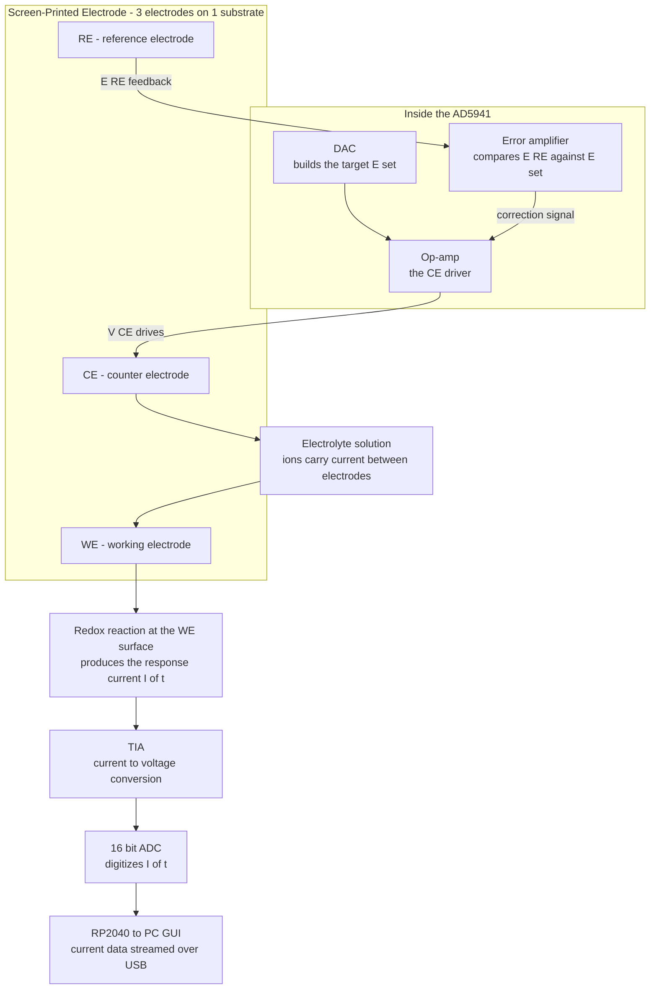

# How Electrochemical Methods Work in Code (AD5941)

This document explains what an electrochemical method is, how it functions physically, and how the underlying physics are translated into C++ code in the HunStat2 firmware.

> **Looking for the picture, not the prose?** `FLOWCHART.md` Part 2 has the same explanation as a set of signal-level flowcharts — system block diagram, excitation path, potentiostat feedback loop, a Generate/React/Detect three-stage view, the response path back to the PC, and a practical RCAL/gain selection table. The feedback-loop diagram is reproduced below since it's the one piece of physical intuition the rest of this document assumes.

---

## 1. What is an Electrochemical Method and How Does It Work?

### 1.1. Core Concept of Electrochemistry
**Electrochemistry** is the study of chemical reactions that involve the transfer of electrons between an electronic conductor (an **electrode**) and an ionic conductor (an **electrolyte** containing chemical species). 

An **electrochemical method** (or analytical technique) is an experiment where we use a electronic instrument (a **potentiostat**) to control the electrical potential (voltage) of the working electrode and measure the resulting current (flow of electrons) as chemical species undergo oxidation or reduction reactions at the electrode surface.

### 1.2. The Three-Electrode Cell Setup
To perform these measurements accurately, we use a **3-electrode cell** configuration. The potentiostat interfaces with these electrodes:

1. **Working Electrode (WE)**: The surface where the chemical reaction of interest takes place. We measure the current flowing into or out of this electrode.
2. **Reference Electrode (RE)**: Provides a stable, constant reference potential (voltage) that does not change. The potentiostat measures the potential of the WE relative to the RE. **Importantly, no current is allowed to flow through the RE** to prevent its potential from drifting.
3. **Counter Electrode (CE)** (or Auxiliary Electrode): Completes the electrical circuit. The potentiostat drives current through the CE to match whatever current is flowing through the WE, maintaining the target potential between WE and RE.

```
       [ Potentiostat Control Feedback Loop ]
                 |                  |
                 v                  v
         +---------------+  +---------------+
         |   RE Pin      |  |    CE Pin     |
         | (Reference)   |  |   (Counter)   |
         +---------------+  +---------------+
                 |                  |
                 v                  v
            ==============================
                  ELECTROCHEMICAL CELL
            ==============================
                          |
                          v
                  +---------------+
                  |    WE Pin     | ----> [ Transimpedance Amp (TIA) ]
                  |   (Working)   |               |
                  +---------------+               v
                                          [ 16-Bit Sigma-Delta ADC ]
                                                  |
                                                  v
                                          [ Raw Digital Code ]
```

### 1.3. Oxidation, Reduction, and Potential
The potential applied to the Working Electrode acts as a "pump" for electrons:
* **Oxidation (Anodic Current)**: If we apply a sufficiently **positive potential** to the WE, we lower the energy of its electrons. The electrode begins to pull electrons *away* from molecules in the solution. This electron loss is oxidation, producing a positive (anodic) current.
* **Reduction (Cathodic Current)**: If we apply a sufficiently **negative potential** to the WE, we raise the energy of its electrons. The electrode begins to push electrons *into* molecules in the solution. This electron gain is reduction, producing a negative (cathodic) current.

### 1.4. Mass Transport and Diffusion
When a reaction occurs at the WE surface, the concentration of the chemical species drops near the electrode. New molecules must travel to the surface to keep the reaction going. This travel happens through **diffusion** (movement from high concentration to low concentration). 

Most electrochemical methods wait for a brief **settling delay** before reading the current to ensure that the current measured is driven by stable diffusion gradients rather than the charging of the electrical "double-layer capacitance" of the cell.

---

## 2. The Core AD5941 Loop: Voltage Excitation & Current Readback

As you noted, the AD5941's job in code is simply:
1. **Apply a target voltage (potential)** between the electrodes.
2. **Wait** for the system to settle.
3. **Measure and read the resulting current** flowing through the cell.

Inside the AD5941 chip:
* **Voltage Generation**: A Digital-to-Analog Converter (either the Low-Power 12-bit DAC or the High-Speed 12-bit DAC) sets the target voltage.
* **Current Measurement**: Current entering the **WE** pin is converted into a voltage using a **Transimpedance Amplifier (TIA)** (with a feedback resistor $R_f$).
* **Analog-to-Digital Conversion**: The output voltage of the TIA is measured by the on-chip **16-bit Sigma-Delta ADC**.
* **Ohm's Law Conversion**: The firmware converts the raw ADC bits back into current using:
  $$\text{Current (Amperes)} = \frac{\text{Measured Voltage}}{\text{PGA Gain} \times R_{TIA}}$$

The signal-level view of that same loop — where the closed loop is actually closed *through the reference electrode*, not the working electrode directly — looks like this (full-size version and four related diagrams in `FLOWCHART.md` Part 2):



If `E_RE` (what the reference electrode actually reports) doesn't match `E_set` (what the host asked for), the error amplifier keeps nudging `V_CE` — never the WE directly — until it does. This is why the switch matrix configuration seen throughout §3–§6 below always routes `RE0` to the potentiostat's sense input (`SWP_RE0`) rather than driving it: the RE's job is to *report*, the CE's job is to *supply current*, and the WE is where the chemistry under study actually happens.

### 2.1. What the HSTIA Registers Actually Configure

The transimpedance amplifier used by CA, SWV, DPV, and EIS (in "measure the cell" mode) is the **High-Speed TIA (HSTIA)**. It is configured through the `HpLoopCfg.HsTiaCfg` struct, written to silicon via `AD5940_HSLoopCfgS()`. Every field matters — leaving any of them at their zeroed/default state produces a TIA that either doesn't amplify at all or routes its output nowhere the ADC can see it (this exact mistake is what §3 below had to fix):

| Field | What it controls | Value used here | Why |
| :--- | :--- | :--- | :--- |
| `HstiaRtiaSel` | Selects the feedback resistor $R_{TIA}$ from a fixed on-chip ladder (200 Ω … 160 kΩ, 8 steps) | `tia_rf` (0–7), synced with `RawToCurrent()`'s `rf_values[]` lookup | This *is* the "gain" of the current-to-voltage conversion — a bigger $R_{TIA}$ gives a bigger output voltage for the same cell current, at the cost of bandwidth and headroom. Getting this out of sync between the config side and the decode side (`RawToCurrent`) silently corrupts every reading by the mismatch ratio. |
| `HstiaBias` | Sets the HSTIA's internal bias/common-mode voltage | `HSTIABIAS_1P1` (1.1 V) | Centers the TIA's output swing so both anodic and cathodic currents can be represented without clipping against the supply rail. |
| `HstiaCtia` | Feedback capacitor in parallel with $R_{TIA}$, in pF | `16` | Provides high-frequency stability (bandwidth limiting) for the TIA feedback loop — without it the amplifier can ring or oscillate on fast current transients. |
| `HstiaDeRtia` / `HstiaDeRload` | Routes the HSTIA's output to the DE0 pin (electrode drive) and configures an optional load resistor there | `HSTIADERTIA_TODE` / `HSTIADERLOAD_OPEN` | Connects the TIA's amplified output where the ADC multiplexer (`ADCMUXP_HSTIA_P`/`ADCMUXN_HSTIA_N`) expects to find it. `HSTIADERLOAD_OPEN` means no extra load is inserted — the DE0 path is only used as the TIA's own output tap here, not to drive an external electrode. |
| `DiodeClose` | Optional protection diode across the TIA feedback path | `bFALSE` | Left open (not shorting the feedback path) for normal-range currents; the diode exists as an overload-protection option for extreme excursions. |

If `HpLoopCfg.HsTiaCfg` is left unconfigured (all fields zero, the struct's default state), `HstiaRtiaSel` decodes to its lowest index and — critically — the DE routing does not connect the amplifier's output to anywhere the ADC mux can read, so conversions return a constant/garbage code that decodes to a current near zero no matter what the cell is actually doing. This is exactly the bug found and fixed in `C_CA`/`C_SWV`/`C_DPV` during this session — see §3 and the architecture document's §8.

> **A related, still-open gap found 2026-08-01**: the switch-matrix line just above this table, `HpLoopCfg.SWMatCfg.Nswitch = SWN_SE0`, is hardcoded identically in `C_CA`, `C_SWV`, and `C_DPV` — there is no serial command or config path anywhere in the firmware to route a different physical working-electrode pin. A live test against a 3-branch dummy cell (one nonlinear diode branch, two plain-resistor/RC branches — see `UPDATE_2026-08-01.md` §2) produced flat, noisy CA/SWV traces with no discernible peak; the leading hypothesis is that `SE0` isn't wired to the one branch capable of producing a peaked response, which this firmware currently has no way to change without rewiring the board. See `ARCHITECTURE_DOCUMENT.md` §9, item 5.

---

## 3. Chronoamperometry (CA) in Code

**Goal**: Apply a single constant voltage to the cell and record the current decay over time.

*(Note: the class-based `C_CA` in `src/electrochemical_methods/c_ca.cpp` is the implementation that actually runs when the host sends `A` — see the architecture document §3.4 for why an older free-function `RunCA()` in the same folder is dead code and should be ignored when reading/patching this behavior.)*

### Step-by-Step Code Flow:
1. **Set Voltage**: The host sends command `1<mV>` (e.g. `1400` for 400 mV), then `A` to run. `1<mV>` is stored in `m_pData->CA_Voltage_mV`; `2<seconds>` and `3<Hz>` set `CA_Duration_s` and `CA_SampleRate_Hz` the same way.
2. **Compute sample count**: `C_CA::Run()` computes `CA_NumSamples = CA_Duration_s * CA_SampleRate_Hz` (clamped to at least 1) before starting.
3. **Initialize AFE**: `C_CA::ConfigDCMeasurement(CA_Voltage_mV)` is called once, before the sampling loop starts (the DC level is held constant for the whole run — CA doesn't step voltage per sample):
   * It turns off the AC Waveform Generator (`AFECTRL_WG` set to false) so the DAC holds a static level instead of a sine wave.
   * It programs the High-Speed DAC to the target potential via `SetDACLevel(voltage_mV)`, wrapped in an `MMR`-type `WGCfg_Type` write.
   * It configures the switch matrix to route Counter→`CE0`, Reference→`RE0`, Working(Sense)→`SE0` (`SWD_CE0`/`SWP_RE0`/`SWN_SE0`/`SWT_TRTIA|SWT_SE0LOAD`).
   * It configures the HSTIA feedback block (see §2.1) — `HstiaRtiaSel` keyed off `tia_rf`, `HstiaBias = HSTIABIAS_1P1`, `HstiaCtia = 16 pF`, `HstiaDeRtia = HSTIADERTIA_TODE`.
   * It powers up the DAC reference, external buffer, in-amp, HSTIA, HSDAC, and DC buffer amplifiers.
   * It sets the ADC multiplexer to read across the HSTIA output (`ADCMUXP_HSTIA_P`/`ADCMUXN_HSTIA_N`) and sets PGA gain to 1×.
   * It configures the ADC filter chain (Sinc3 OSR=4, Sinc2 OSR=1333, 16-sample averaging, notch enabled).
   * It routes the `SINC2RDY` interrupt source into `AFEINTC_1` and clears any stale flag — required for the next step's ready-poll to ever see a true flag instead of timing out.
4. **Sampling loop**: for each of the `CA_NumSamples` iterations:
   * **Start ADC**: `C_CA::MeasureCurrentRaw()` turns on `AFECTRL_ADCPWR | AFECTRL_ADCCNV`.
   * **Settle**: waits `delayMicroseconds(500)` for the double-layer charging transient to settle before the conversion is trusted.
   * **Read Result**: `AD5940_TakeMeasurement()` polls the `SINC2RDY` ready flag (timeout budget: 1000 × 10 µs ticks) and returns the raw `AFERESULT_SINC2` code.
   * **Convert to Current**: `RawToCurrent()` interprets the low 16 bits as signed two's-complement, then computes `I = (code × 1.82 V / 32768) / (PGA_gain × R_TIA)` using the `tia_rf`-selected resistor from the same `rf_values[]` table used in configuration.
   * **Stream**: formats `CA,<time_s>,<current_A>` (e.g. `CA,0.5000,-1.8157e-04`) and prints it over Serial.
   * **Pace the loop**: `delay(1000 / CA_SampleRate_Hz)` blocks until the next sample is due — this is a simple fixed-rate scheduler, not a hardware timer, so very high `CA_SampleRate_Hz` values are bounded by how fast the loop body itself executes.
5. **Wrap-up**: after the loop, `AD5940_AFECtrlS()` powers down the ADC, waveform generator, and DAC reference, and the firmware prints `CA_END` as an explicit end-of-stream marker (see the hardware test script `python_ui/test_hardware_ca_swv_dpv.py`, which waits for exactly this marker with a hard deadline rather than blocking indefinitely).

---

## 4. Cyclic Voltammetry (CV) in Code

**Goal**: Sweep the voltage linearly from $V_{start}$ to $V_{stop}$, and then back to $V_{start}$, measuring the current continuously to observe oxidation and reduction peaks.

### Step-by-Step Code Flow:
*Because CV sweeps are fast and require precise timing, doing this in microcontroller loops causes jitter. Instead, the firmware compiles commands directly into the AD5941's internal **Hardware Sequencer SRAM**.*

1. **Setup Parameters**: The variables `V_Start`, `V_Stop`, `EStep` (step size), and `ScanRate` (speed) are configured. **These are all millivolt-scale** (`RampTest.h`'s `DAC12BITVOLT_1LSB = 2200/4095 ≈ 0.537 mV` — every field in `AppRAMPCfg_Type` is mV-based, matching CA/SWV/DPV's convention elsewhere in this document). A 2026-08-01 bug in the Python UI sent these four fields in volts instead — e.g. `0.5` instead of `500` — which collapsed a normal ~700-point sweep down to exactly 2 points, since the step-count formula below effectively saw a sub-1mV total voltage swing. Fixed on the UI side (`hunstat2_test_ui.py` now converts V→mV before sending); see `UPDATE_2026-08-01.md` §3.1 for the full derivation.
2. **Sequencer Compilation (`AppRAMPInit`)**:
   * The code calculates the list of voltage steps from start to peak and back.
   * It compiles sequencer command blocks:
     * **SEQ0/SEQ1**: Commands instructing the AFE to write a new voltage step code directly to the LP-DAC register, wait for settling, and sleep.
     * **SEQ2**: Commands instructing the AFE to wake up and turn on the ADC.
3. **Trigger Sweeps (`AppRAMPCtrl`)**:
   * The **Wakeup Timer (WUPT)** is configured to run at intervals matching the scan rate.
   * On every timer tick, the hardware runs the compiled sequences:
     `Update Voltage (SEQ0/SEQ1) -> Wait Settling -> Start ADC (SEQ2) -> Capture Data`
4. **Interrupt Handling (`AppRAMPISR`)**:
   * Each time a step completes, the AFE pulls the microcontroller's interrupt pin (`A2`) LOW.
   * The RP2040 runs `AppRAMPISR()`:
     * It reads the raw samples out of the AFE's FIFO buffer.
     * It averages the samples to remove high-frequency noise.
     * It prints the resulting Voltage vs. Current coordinate over Serial.

---

## 5. Square Wave Voltammetry (SWV) in Code

**Goal**: Sweep potential in a staircase pattern, but overlay a high-frequency square wave pulse on each step to eliminate background charging current.

```
Voltage
  ^
  |          Forward Pulse (V_forward = V_step + Amplitude)
  |            _
  |          /   \
  |         |     |
  |    _____|     |_____  <- Staircase Step (V_step)
  |               |     |
  |                \   /
  |                  -    <- Reverse Pulse (V_reverse = V_step - Amplitude)
  +------------------------------------------------------------> Time
```

### Step-by-Step Code Flow:
For each step in the staircase sweep:
1. **Apply Forward Potential**: 
   * The potential is set to $V_{forward} = V_{step} + V_{amplitude}$ using `ConfigDCMeasurement()`.
   * It waits for `SWV_CurrentSampleDelay_s` (e.g. 20 ms).
   * It takes an ADC reading ($I_{forward}$) using `MeasureCurrentRaw()`.
2. **Apply Reverse Potential**: 
   * The potential is set to $V_{reverse} = V_{step} - V_{amplitude}$ using `ConfigDCMeasurement()`.
   * It waits for `SWV_CurrentSampleDelay_s`.
   * It takes an ADC reading ($I_{reverse}$) using `MeasureCurrentRaw()`.
3. **Differential Math**: 
   * It computes $\Delta I = I_{forward} - I_{reverse}$.
4. **Stream**:
   * Outputs the coordinate `SWV,<voltage>,<delta_I>`.
5. **Next Step**: Increments the staircase baseline voltage $V_{step}$ and repeats.

`C_SWV::ConfigDCMeasurement()` performs the identical HSTIA + `SINC2RDY`→`AFEINTC_1` setup described in §2.1 and §3 for CA — both forward-pulse and reverse-pulse readings go through the same `MeasureCurrentRaw()`/`RawToCurrent()` pair as CA, just called twice per step instead of once.

---

## 6. Differential Pulse Voltammetry (DPV) in Code

**Goal**: Sweep potential in a staircase pattern, applying a periodic voltage pulse at each step to isolate faradaic reactions.

```
Voltage
  ^
  |                       Pulse (V_pulse = V_step + Amplitude)
  |                         ________
  |                        |        |
  |                        |        |
  |    ____________________|        |____  <- Staircase Step (V_step)
  |    ^                            ^
  |    |                            |
  |  Sample Base Current          Sample Pulse Current
  |   (I_base)                     (I_pulse)
  +------------------------------------------------------------> Time
```

### Step-by-Step Code Flow:
For each step in the staircase sweep:
1. **Sample Base Current**:
   * Applies the staircase baseline potential $V_{step}$ to the cell using `ConfigDCMeasurement()`.
   * Waits for settling, then measures base current ($I_{base}$) using `MeasureCurrentRaw()`.
2. **Sample Pulse Current**:
   * Applies the pulse potential $V_{pulse} = V_{step} + V_{amplitude}$ using `ConfigDCMeasurement()`.
   * Waits for settling, then measures pulse current ($I_{pulse}$) using `MeasureCurrentRaw()`.
3. **Differential Math**:
   * Computes $\Delta I = I_{pulse} - I_{base}$.
4. **Stream**:
   * Outputs the coordinate `DPV,<voltage>,<delta_I>`.
5. **Wait and Increment**:
   * Delays for the remainder of the pulse period, increments $V_{step}$, and repeats.

`C_DPV::ConfigDCMeasurement()` mirrors CA/SWV's HSTIA + `SINC2RDY`→`AFEINTC_1` setup (§2.1, §3). The staircase step size (`DPV_Step_mV`) is set with the `!<float>` serial command — added this session; previously there was no way to change it without editing `DEFAULT_DPV_STEP` in `data_storage.h` and reflashing.

---

## 7. Electrochemical Impedance Spectroscopy (EIS) in Code

**Goal**: Apply an AC sine wave voltage perturbation at various frequencies, measure the amplitude and phase shift of the resulting AC current, and calculate the cell impedance ($Z$).

### Step-by-Step Code Flow:
For each log-spaced frequency step:
1. **Configure AC Waveform**:
   * `Do_WaveGen()` programs the high-speed sinusoidal wave generator.
   * It calculates the required frequency control word using the system clock ($16\text{ MHz}$).
2. **Route Switches**:
   * Mode `0` (working scan): routes the excitation wave through the CE pin, and TIA to the WE pin.
   * Mode `1` (calibration scan): routes the excitation wave through the internal calibration resistor ($R_{cal}$).
3. **Configure DFT Engine**:
   * The AD5941 has an onboard **Discrete Fourier Transform (DFT) hardware accelerator**.
   * `Hardware_Init_AD5940_ADC()` configures the DFT size (e.g. 16384 points for low frequencies, 4096 for mid-range).
4. **Acquire DFT Data**:
   * The ADC samples the TIA current output.
   * The DFT engine processes the ADC samples in real-time, calculating:
     * **DFT_REAL**: Cosine component of the AC current vector.
     * **DFT_IMAG**: Sine component of the AC current vector.
   * The firmware reads these real/imaginary values directly from the FIFO read register `REG_AFE_DATAFIFORD`.
5. **Nyquist Impedance Calculation**:
   * In SeeedStat mode, it performs two sweeps (one on the cell $R_z$, one on $R_{cal}$).
   * The magnitude ($\text{mag}$) and phase ($\text{phase}$) are calculated for both sweeps:
     $$\text{mag} = \sqrt{\text{Real}^2 + \text{Imag}^2}$$
     $$\text{phase} = \text{atan2}(-\text{Imag}, \text{Real})$$
   * The cell impedance is computed relative to the known calibration resistor value ($fR_{cal}$):
     $$Z_{mag} = \left|\frac{\text{mag}_{R_{cal}}}{\text{mag}_{R_z}}\right| \times fR_{cal}$$
     $$Z_{phase} = \text{phase}_{R_z} - \text{phase}_{R_{cal}}$$
   * The impedance is converted back to Cartesian Nyquist coordinates ($X = \text{Real } Z$, $Y = \text{Imag } Z$):
     $$\text{Nyquist } X = Z_{mag} \times \cos(Z_{phase})$$
     $$\text{Nyquist } Y = Z_{mag} \times \sin(Z_{phase})$$
   * The resulting Nyquist points are printed to the Serial monitor.
