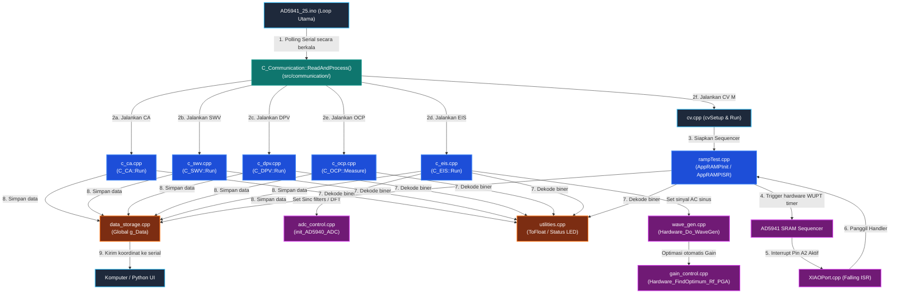
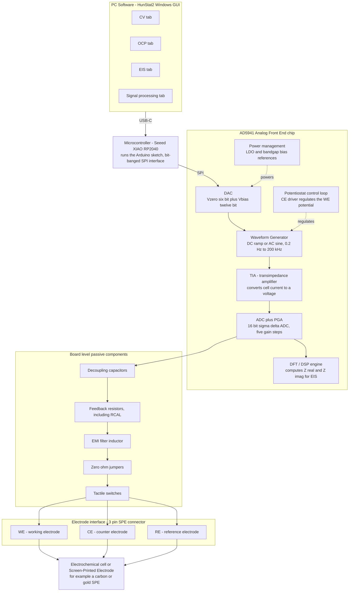
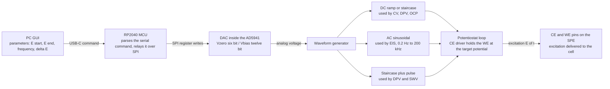
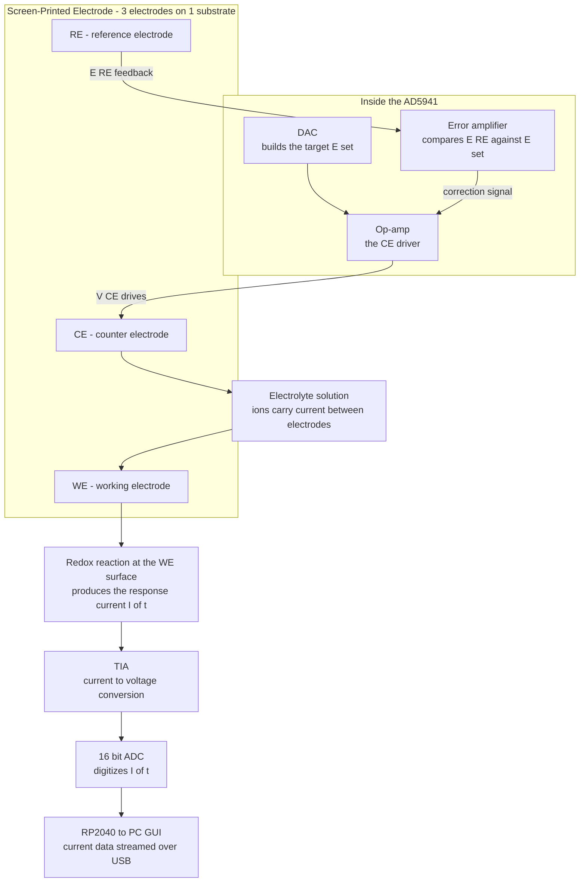
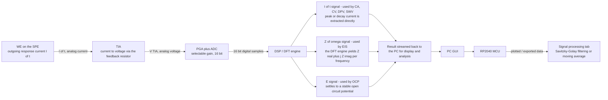

# Flowchart Panggilan Kode (Call Flow Chart)

Diagram di bawah ini menggambarkan bagaimana modul-modul program saling berinteraksi, mulai dari file utama (**Main Orchestrator**), parser perintah serial (**Communication Layer**), hingga ke submodul **Hardware** dan **Metode Elektrokimia** di dalam folder `src/`.

---

## Diagram Alur Arsitektur (Mermaid Flowchart)

---

## Penjelasan Alur Interaksi

1. **Orkestrator Utama (`AD5941_25.ino`)**:
   * Menjalankan fungsi `loop()` secara terus-menerus.
   * Melakukan polling ke `C_Communication::ReadAndProcess()` untuk membaca perintah yang dikirim komputer lewat USB Serial.

2. **Parser Perintah (`src/communication/`)**:
   * Membaca buffer serial dan membagi perintah (tokenisasi).
   * Melakukan *routing* panggilan langsung ke kelas metode elektrokimia yang sesuai di `src/electrochemical_methods/` (seperti `c_eis.cpp`, `c_ca.cpp`, dll).

3. **Metode Non-Ramp (CA, SWV, DPV, OCP, EIS)**:
   * Mengatur bias tegangan sel menggunakan Low-Power DAC secara langsung.
   * Menghubungi modul hardware untuk inisialisasi filter (`adc_control.cpp`) atau generator gelombang AC (`wave_gen.cpp`).
   * Menunggu jeda kimiawi (*settling delay*).
   * Membaca hasil register konversi ADC, mengubah nilai biner 18-bit ke bentuk float voltase/arus (`utilities.cpp`), menyimpannya di memori (`data_storage.cpp`), lalu mengirimkannya ke Serial.

4. **Metode Ramp (Cyclic Voltammetry / CV)**:
   * Karena memerlukan kecepatan tinggi, CV memanggil konfigurasi di `cv.cpp` yang meneruskannya ke mesin sequencer `rampTest.cpp`.
   * Perintah dirangkai langsung di memori SRAM AD5941. Saat berjalan, chip mengaktifkan jalur interrupt MCU (`A2`) setiap kali selesai membaca step.
   * Fungsi `AppRAMPISR()` mengambil data dari FIFO chip, merata-ratakannya, lalu melakukan konversi dan penyimpanan.

---

## Catatan Tambahan (hasil verifikasi kode terbaru)

Dua hal berikut tidak terlihat dari diagram di atas karena diagram hanya menggambarkan jalur pemanggilan yang **aktif**:

1. **Jalur mati yang ikut ter-compile tapi tidak pernah dipanggil.** Selain `Comm` (`src/communication/communication.cpp`, jalur yang benar-benar dijalankan oleh `AD5941_25.ino`), ada satu set implementasi lama yang duplikat: `src/command_processing/command_processing.cpp` (parser serial versi prosedural) dan bagian atas `src/electrochemical_methods/electrochemical_methods.cpp` (fungsi bebas `RunCA`/`RunSWV`/`RunDPV`). Arduino tetap meng-compile kedua file ini karena berada di dalam folder sketch, tapi tidak ada satu pun pemanggil di `loop()` yang mengarah ke sana — jadi keduanya tidak pernah tereksekusi. Selengkapnya di `ARCHITECTURE_DOCUMENT.md` §3.4/§8 dan `TECHNICAL_REPORT_EN.md` §5.
2. **Transport SPI ke AD5941 sekarang bit-banged, bukan `SPI` hardware bawaan RP2040.** Node `XIAOPort.cpp` di diagram di atas kini mengimplementasikan SPI Mode 0 secara manual lewat `digitalWrite`/`digitalRead` pada pin `D8`/`D9`/`D10`, karena wiring board ini menukar posisi MISO/MOSI dibanding pin-mux SPI0 bawaan XIAO RP2040. Detail lengkap di `TECHNICAL_REPORT_EN.md` §4.1 dan §7.4.
3. **Update 2026-08-01**: folder proyek berpindah ke `Software/update 2 (18 Juli 26)/AD5941_25/`, sempat gagal compile karena path `#include` yang usang di `HunStat2.ino` dan dua sketch (`HunStat2.ino`/`AD5941_25.ino`) yang saling bentrok dalam satu folder sketch — keduanya sudah diperbaiki. Uji coba dengan dummy cell 3-cabang juga menemukan dua bug di `python_ui/hunstat2_test_ui.py`: parameter CV terkirim dalam satuan volt padahal firmware mengharapkan milivolt (sehingga sweep CV selalu berhenti di 2 titik data), dan plot DPV menggambar garis diagonal palsu karena data run sebelumnya tidak dibersihkan sebelum run baru. Detail lengkap ada di `UPDATE_2026-08-01.md`, ringkasan di `ARCHITECTURE_DOCUMENT.md` §9 dan `TECHNICAL_REPORT_EN.md` §11.

---

# Part 2 — How the AD5941 Actually Works (Signal-Level Flowcharts)

The diagrams above describe the *software* call graph — which function calls which. This part is a different, complementary view: how a voltage command actually becomes a physical measurement, tracing signal flow through the PC, the microcontroller, the AD5941's internal analog blocks, the electrode connector, and the electrochemical cell itself. It mirrors the block-diagram set from the project's internal "Update Potensiostat" presentation, redrawn here in English and cross-checked line-by-line against the firmware described in Part 1 and in `ELECTROCHEMICAL_METHODS_EXPLANATION.md` / `TECHNICAL_REPORT_EN.md`.

## 1. System Block Diagram

Compared to the presentation slide this is redrawn from: the ADC/PGA block there is captioned "gain 1 to 512", but the firmware actually only exposes five discrete PGA steps (1.0x, 1.5x, 2.0x, 4.0x, 9.0x — `gain_control.cpp`'s `pga_values[]`). The wider number almost certainly refers to the *combined gain* range achievable once the eight TIA feedback resistor steps (200 Ω … 160 kΩ) are multiplied in — see `TECHNICAL_REPORT_EN.md` §3.4 for the exact interpolation formula used to pick both automatically.

## 2. Excitation Signal Path (PC to Cell)

This matches the firmware's per-method `ConfigDCMeasurement()`/`Hardware_Do_WaveGen()` split described in `ELECTROCHEMICAL_METHODS_EXPLANATION.md`: CA/DPV/SWV/OCP drive a static or stepped DC level through the `WGTYPE_MMR` path, while EIS drives a continuous sine through `WGTYPE_SIN`. Both paths ultimately write the same `HpLoopCfg.WgCfg` structure.

## 3. Potentiostat Feedback Loop (Detail)

This is the core control loop that makes a *potentiostat* a potentiostat: it forces the working electrode's potential to track a target value by adjusting the counter electrode, rather than by driving the working electrode directly.

**Why the loop is closed through the reference electrode, not the working electrode:** the whole point of a 3-electrode cell (§1.2 of `ELECTROCHEMICAL_METHODS_EXPLANATION.md`) is that no current is allowed to flow through the RE, so its potential never drifts from Faradaic reactions at its own surface. If `E_RE` measured against `E_set` shows an error, the op-amp keeps adjusting `V_CE` — never `V_WE` directly — until the RE reports the correct potential. All the current needed to sustain that potential is supplied or sunk through the CE instead.

## 4. Generate, React, Detect — The Three-Stage View

A simpler way to see the same loop: as three stages that data flows through once per excitation step (once per CV/DPV/SWV point, or continuously for CA/EIS/OCP sampling).

```mermaid
graph LR
    subgraph GEN[1. GENERATE - build the excitation voltage]
        DACg[DAC inside the AD5941<br/>builds E set: ramp, sine, or staircase]
        DRVg[CE driver op-amp<br/>amplifies and sends it to the CE pin]
        DACg --> DRVg
    end

    subgraph CELL3[2. In the cell - the SPE - reaction happens here]
        CEc[CE<br/>pumps current into the solution]
        WEc[WE<br/>where the reaction of interest happens]
        REc[RE<br/>senses the cell potential]
        SOLc[Electrolyte solution<br/>ion current]
        RXc[Redox reaction<br/>oxidized species plus electron gives reduced species, producing I of t]
        CEc --> SOLc --> WEc --> RXc
    end

    subgraph DET[3. DETECT - read the resulting current]
        TIAd[TIA<br/>current times feedback resistance gives a voltage]
        PGAd[PGA plus 16 bit ADC<br/>amplifies and digitizes, down to roughly 54 pA resolution]
        DFTd[DSP / DFT engine<br/>computes Z real and Z imag, EIS only]
        MCUd[RP2040 MCU<br/>packages the data, sends it over USB-C]
        GUId[PC GUI<br/>plots the voltammogram or Nyquist curve]
        TIAd --> PGAd --> DFTd --> MCUd --> GUId
    end

    DRVg -- V CE to the CE pin --> CEc
    RXc -- current I of t --> TIAd
    REc -- E RE feedback to the comparator --> DRVg
```

**Why three electrodes, in one line each:** CE pumps whatever current the loop needs into the solution; WE is the fixed, characterized surface where the reaction under study actually happens; RE is a low-current sensor that tells the loop what potential the WE is really sitting at, so the loop can correct for it.

## 5. Response Signal Path (Cell back to PC)

For CA/SWV/DPV this path runs through `MeasureCurrentRaw()`/`RawToCurrent()` once (CA) or twice (SWV/DPV, forward+reverse or base+pulse) per step — see `ELECTROCHEMICAL_METHODS_EXPLANATION.md` §3–§6. For EIS the same TIA/PGA/ADC hardware feeds the on-chip DFT accelerator instead of a single Sinc2 sample, producing one complex `(Z_real, Z_imag)` pair per frequency point — see §7 there and §3.3/§6 of `TECHNICAL_REPORT_EN.md`.

## 6. Practical Guide — Choosing RCAL, `tia_rf`, and Gain for a Given Sample

The auto-gain formula in `TECHNICAL_REPORT_EN.md` §3.4 picks a TIA resistor and PGA gain automatically from `CGMax`/`CGMin`, but those two limits still have to be set sensibly for the impedance range you actually expect from the sample. `RCAL` (the on-board calibration resistor selected in hardware, decoded to the firmware via `tia_rf`) should be chosen to sit near the middle of the sample's expected impedance range — too small and the TIA output barely moves for the current involved; too large and it saturates.

| RCAL | `tia_rf` (`r`) | `amplitude` (`z`/`Y`) | `_CGmax` (`t`) | `_CGmin` (`u`) | Typical measured Z range | Good for |
|---|---|---|---|---|---|---|
| 3.3 Ω | `r0` (200 Ω) | `z20` (≈8 mV) | 1000 | 300 | ~0.3 Ω – 330 Ω | Metals, carbon electrodes, low-ESR Li-ion cells |
| 4.7 Ω | `r0` (200 Ω) | `z30` (≈12 mV) | 1500 | 400 | ~0.5 Ω – 470 Ω | Batteries, supercapacitors, active corrosion |
| 200 Ω | `r1` (1 kΩ) | `z60`/`Y40`-`Y80` (≈24 mV) | 5000 | 1500 | ~20 Ω – 20 kΩ (sweet spot 100 Ω – 1 kΩ) | Dilute-to-moderate electrolytes (1x PBS ≈100–300 Ω, 0.1 M NaCl ≈200 Ω), impedimetric biosensors, pH/ion-selective electrodes, electrodeposition baths |
| 10 kΩ (default) | `r3` (10 kΩ) | `z126`/`Y126` (≈50 mV) | 30000 | 7500 | ~1 kΩ – 100 kΩ (sweet spot 5 kΩ – 50 kΩ) | Very dilute electrolytes and deionized water, polymer/membrane films (e.g. Nafion), soil/sediment EIS, semiconductor and solar-cell junction characterization |

The `c<value>` serial command sets `fRcal` (the *value* used in the Nyquist math, §6 of `ELECTROCHEMICAL_METHODS_EXPLANATION.md`) — it must match whichever physical RCAL resistor is actually populated on the board, since `C_EIS::CalculateNyquistCurve()` scales every impedance point by `fRcal` directly. Setting `c` to a value that doesn't match the installed resistor produces a Nyquist plot that is correctly *shaped* but wrong in *scale* by a constant factor.
